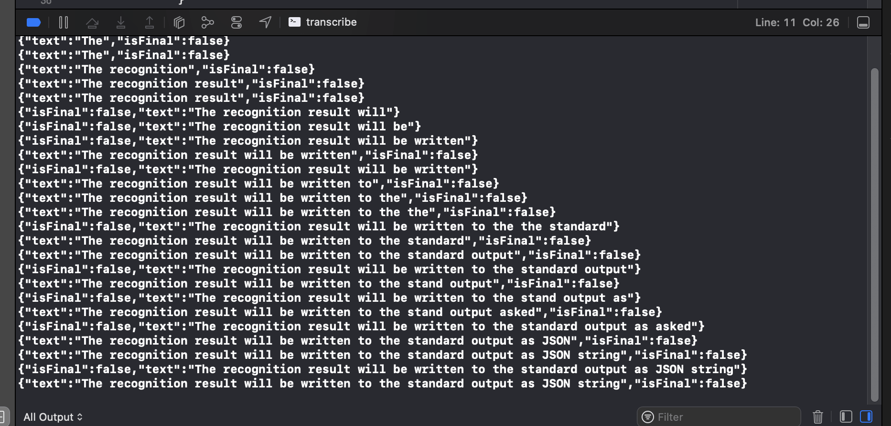

# transcriber

CLI tool for macOS that uses SFSpeechRecognizer to transcribe speech. The recognition result will be written to the standard output as JSON string. The input data should be sent to the standard input as **raw PCM, 16-bit signed integer, 16 kHz, mono**.



⚠️ 🚧 **WARNING:** 💩 code ahead 🚧 ⚠️

## HELP WANTED

- There is no error handling here, sometimes it doesn’t work. I don’t know why.

Some help would be appreciated.

## How to use

Compile:

```
swiftc -o transcriber transcribe/main.swift
```

Install to `/usr/local/bin`:

```
cp transcriber /usr/local/bin
```

Make sure Dictation feature is enabled in your system preferences, easiest way to enable this is by enabling Siri.

Then you can use it like this:

```
rec -b 16 -c 1 -t raw -e signed-integer - rate 16000 | ./transcriber
```

By default it will transcribe English speech.

## Change the language

To change the language, you can provide a new language code as the first argument to the binary. For example, to use Thai, you can run:

```
rec -b 16 -c 1 -t raw -e signed-integer - rate 16000 | ./transcriber th
```

## Ideas

- Turn this into an HTTP speech recognition server that streams out server-sent events, so other apps can integrate with it, I guess?
